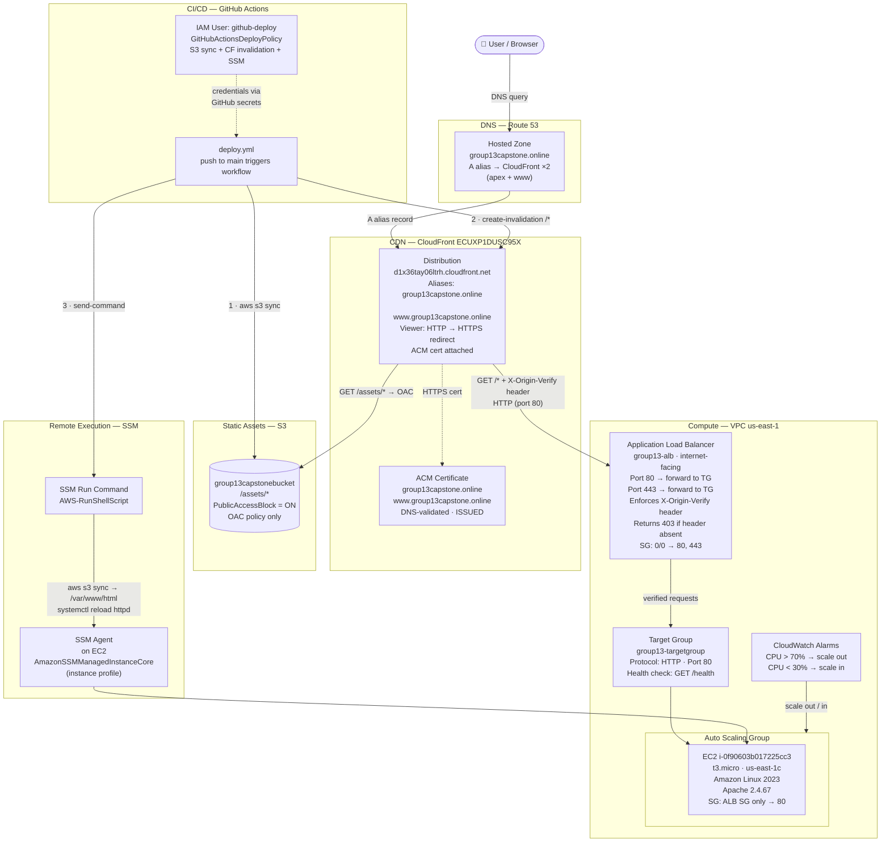

# Group 13 Capstone — AWS Architecture Documentation

**Account:** `230195035490` · **Region:** `us-east-1` · **Domain:** `group13capstone.online`

---

## Architecture Diagram



---

## Component Reference

### 1. VPC and Networking

All compute resources live inside a default VPC in `us-east-1`. Traffic is controlled by two security groups and a verified custom HTTP header — no resource is reachable directly from the public internet except through CloudFront.

| Resource | Value |
|---|---|
| Region | `us-east-1` |
| EC2 Availability Zone | `us-east-1c` |
| EC2 Security Group | Allows port 80 **from ALB SG only** — no direct public access |
| ALB Security Group | `sg-0a4cc8218bac82157` (`group13-alb-sg`) — allows 0.0.0.0/0 on 80 and 443 |

**Why EC2 is not directly reachable:** The EC2 security group only permits inbound port 80 from the ALB security group (`sg-0a4cc8218bac82157`). Even if someone knows the EC2 public IP (`3.90.216.6`), requests are blocked at the SG level. The ALB itself also enforces the `X-Origin-Verify` custom header (see CloudFront section), so even a request that reaches the ALB but doesn't come from CloudFront gets a 403.

---

### 2. EC2

| Property | Value |
|---|---|
| Instance ID | `i-0f90603b017225cc3` |
| Type | `t3.micro` |
| AMI | Amazon Linux 2023 |
| Web server | Apache 2.4.67 (`httpd`) |
| Document root | `/var/www/html/` |
| Public IP | `3.90.216.6` (blocked by SG — for SSM health check only) |
| Instance profile | `Group13EC2DeployProfile` |
| Key pair | `Group13KeyPair` (stored offline — access via SSM in practice) |

The instance profile grants two permissions: `AmazonSSMManagedInstanceCore` (SSM agent registration and Run Command) and read access to `group13capstonebucket` (so the instance can pull files from S3 during deployment).

---

### 3. Application Load Balancer (ALB)

| Property | Value |
|---|---|
| Name | `group13-alb` |
| Type | Internet-facing, HTTP/HTTPS |
| Port 80 listener | Forward to `group13-targetgroup` |
| Port 443 listener | Forward to `group13-targetgroup` (ACM cert attached) |
| Target group | `group13-targetgroup` · port 80 · health check `GET /health` |

**Custom header enforcement (origin protection):**

CloudFront injects `X-Origin-Verify: FcyYdCvMhF9bM91lIlVmmHbeI-sjVj9BS345Lc81R5I` on every request to the ALB origin. The ALB listener has two rules:

- **Priority 1** — if `X-Origin-Verify` header matches → forward to target group
- **Default** — return 403 Forbidden

This means even if the ALB DNS name is discovered, it returns 403 to anyone not coming through CloudFront.

**Why port 80 is a forward, not a redirect:** CloudFront connects to the ALB over HTTP (port 80). If the ALB listener redirected HTTP → HTTPS, CloudFront would receive a 301 redirect and loop. The HTTPS redirect happens at the CloudFront viewer level instead.

---

### 4. Auto Scaling Group

| Property | Value |
|---|---|
| Launch template | `t3.micro`, Amazon Linux 2023, same instance profile |
| Minimum capacity | 1 |
| Maximum capacity | (set per team need) |
| Desired capacity | 1 |

**CloudWatch alarms:**

| Alarm | Threshold | Action |
|---|---|---|
| Scale out | CPU utilisation > 70% for 2 consecutive periods | Add 1 instance |
| Scale in | CPU utilisation < 30% for 2 consecutive periods | Remove 1 instance |

The existing EC2 instance (`i-0f90603b017225cc3`) was attached to the ASG. When it was attached, the ASG automatically incremented desired capacity to 2; this was reset to 1 with `update-auto-scaling-group --desired-capacity 1`.

---

### 5. S3

| Property | Value |
|---|---|
| Bucket | `group13capstonebucket` |
| Region | `us-east-1` |
| Public access | Fully blocked (`BlockPublicAcls`, `IgnorePublicAcls`, `BlockPublicPolicy`, `RestrictPublicBuckets` all `true`) |
| Access control | CloudFront Origin Access Control (OAC) — only CloudFront can read objects |
| Purpose | Serves static assets (`/assets/css/`, `/assets/js/`, `/assets/img/`) |

The bucket policy was generated by CloudFront when OAC was configured. It allows `s3:GetObject` only when the request comes from the specific CloudFront distribution (`ECUXP1DUSC95X`) via the OAC signing mechanism. No other principal — including `*` — can read objects.

---

### 6. CloudFront

| Property | Value |
|---|---|
| Distribution ID | `ECUXP1DUSC95X` |
| Domain | `d1x36tay06ltrh.cloudfront.net` |
| Aliases | `group13capstone.online`, `www.group13capstone.online` |
| Viewer protocol | Redirect HTTP to HTTPS |
| ACM certificate | `group13capstone.online` + SAN `www.group13capstone.online` |

**Origins:**

| Origin | Type | Protocol | Notes |
|---|---|---|---|
| ALB (`group13-alb`) | Custom (HTTP) | HTTP only (port 80) | Injects `X-Origin-Verify` custom header |
| S3 (`group13capstonebucket`) | S3 + OAC | HTTPS (S3 native) | OAC signs requests |

**Cache behaviours (evaluated in order):**

| Path pattern | Origin | Notes |
|---|---|---|
| `/assets/*` | S3 | Static CSS/JS/images served from S3 with 24h `Cache-Control` |
| `*` (default) | ALB | All other requests proxied to EC2 through ALB |

**Why ALB origin uses HTTP, not HTTPS:** CloudFront would validate the ALB's TLS certificate against the ALB's DNS hostname. The ACM certificate is issued for `group13capstone.online`, not the ALB hostname, so HTTPS origin would fail SSL validation. HTTPS is enforced at the viewer edge (CloudFront → browser) — the CloudFront → ALB leg uses HTTP inside AWS's private network.

---

### 7. ACM (Certificate Manager)

| Property | Value |
|---|---|
| Domain | `group13capstone.online` |
| SAN | `www.group13capstone.online` |
| Validation method | DNS (CNAME records in Route 53) |
| Status | ISSUED |
| Attached to | CloudFront distribution `ECUXP1DUSC95X` |

ACM certificates used with CloudFront **must be in `us-east-1`**, regardless of where other resources are deployed. The certificate covers both the apex domain and `www` so both aliases on the distribution are valid.

---

### 8. Route 53

| Record | Type | Value |
|---|---|---|
| `group13capstone.online` | A (alias) | CloudFront `d1x36tay06ltrh.cloudfront.net` |
| `www.group13capstone.online` | A (alias) | CloudFront `d1x36tay06ltrh.cloudfront.net` |
| ACM validation CNAME ×2 | CNAME | Auto-generated by ACM |

The domain registrar's nameservers were updated to point to the Route 53 NS records for the hosted zone. Before this change, DNS queries resolved using the registrar's servers and the site was unreachable via the custom domain.

---

### 9. IAM

#### `github-deploy` user — CI/CD identity

Used exclusively by GitHub Actions. Access key stored as GitHub repository secrets (`AWS_ACCESS_KEY_ID`, `AWS_SECRET_ACCESS_KEY`).

Policy `GitHubActionsDeployPolicy` grants:

| Permission | Resource | Purpose |
|---|---|---|
| `s3:PutObject`, `s3:GetObject`, `s3:DeleteObject`, `s3:ListBucket` | `group13capstonebucket` | Sync website files to S3 |
| `cloudfront:CreateInvalidation` | Distribution `ECUXP1DUSC95X` | Purge CDN cache after deploy |
| `ssm:SendCommand` | EC2 instance + `AWS-RunShellScript` document | Trigger deployment on EC2 |
| `ssm:GetCommandInvocation` | `*` | Poll command result (requires `*` — cannot be scoped to instance ARN) |

#### `Group13EC2DeployProfile` — EC2 instance profile

Attached to the EC2 instance. Grants:

| Permission | Purpose |
|---|---|
| `AmazonSSMManagedInstanceCore` | SSM agent registration, Session Manager, Run Command |
| `s3:GetObject`, `s3:ListBucket` on `group13capstonebucket` | Pull website files from S3 during deployment |

#### Team users

Six team members (Betty, Esther, Ezekiel, Kelvin, Othniel, Vera) are in the `Group13_CapstoneProject` IAM group with `AdministratorAccess` for the duration of the capstone.

---

### 10. CI/CD — GitHub Actions

**File:** [.github/workflows/deploy.yml](.github/workflows/deploy.yml)  
**Trigger:** Push to `main` branch (or manual `workflow_dispatch`)

#### Job 1: `deploy-s3`

1. Check out repository code
2. Configure AWS credentials from repository secrets
3. Sync `./assets` → `s3://group13capstonebucket/assets` (with `--delete`, `Cache-Control: max-age=86400`)
4. Copy `./index.html` → `s3://group13capstonebucket/index.html`
5. Sync `./pages` → `s3://group13capstonebucket/pages` (with `--delete`)
6. Invalidate CloudFront cache path `/*`

#### Job 2: `deploy-ec2` (runs after `deploy-s3`)

1. Configure AWS credentials
2. Send SSM Run Command (`AWS-RunShellScript`) to instance `i-0f90603b017225cc3`:
   ```bash
   aws s3 sync s3://group13capstonebucket/assets /var/www/html/assets --delete
   aws s3 cp  s3://group13capstonebucket/index.html /var/www/html/index.html
   aws s3 sync s3://group13capstonebucket/pages /var/www/html/pages --delete
   chown -R apache:apache /var/www/html/
   chmod -R 755 /var/www/html/
   systemctl reload httpd
   ```
3. Wait for command completion (`aws ssm wait command-executed`)
4. Check command status — exits 1 if not `Success`
5. Curl `http://3.90.216.6/health` — exits 1 if not HTTP 200

No SSH key is stored in GitHub. Deployment uses SSM Run Command, which requires only IAM credentials and the `AmazonSSMManagedInstanceCore` policy on the instance role.

---

## End-to-End Request Flow

```
Browser
  │
  ├─ DNS: group13capstone.online → Route 53 A alias → CloudFront edge
  │
  ▼
CloudFront edge  (HTTPS enforced, ACM cert presented to browser)
  │
  ├─ Path /assets/* ──────────────────────────────────────────────►  S3 (OAC)
  │                                                                    └─ Returns CSS / JS / images
  │
  └─ Path /* (default)  ──►  ALB  (HTTP, X-Origin-Verify header injected)
                              │
                              ├─ Header present & correct → forward to Target Group
                              └─ Header missing / wrong  → 403 Forbidden
                                          │
                                          ▼
                                    EC2 (Apache)
                                    /var/www/html/
                                    Returns HTML page
```

---

## Security Hardening Summary (Phase 3)

| Control | What it does |
|---|---|
| EC2 SG restricts to ALB SG | No direct access to EC2 from internet |
| ALB `X-Origin-Verify` header | Only CloudFront can trigger a valid ALB response |
| S3 OAC + public access block | S3 objects are inaccessible without CloudFront signing |
| CloudFront viewer HTTPS redirect | All browser traffic is encrypted in transit |
| ACM cert with www SAN | Both apex and www domains served over valid HTTPS |
| IAM least privilege (`github-deploy`) | CI/CD credentials can only touch their specific S3 bucket and CF distribution |
| SSM instead of SSH keypair | No long-lived SSH keys stored in GitHub — access is IAM-controlled |

---

## Troubleshooting Log — Key Issues Encountered

| Issue | Root Cause | Fix |
|---|---|---|
| CloudFront 502 Bad Gateway | CF→ALB origin set to `https-only`; ALB cert is for domain name, not ALB hostname — TLS validation fails | Changed ALB origin protocol to `http-only` |
| ALB breaking CF requests with 301 | ALB port 80 listener was set to redirect HTTP→HTTPS; CF connects on HTTP and got bounced | Changed port 80 listener action to `forward` |
| SSM `InvalidInstanceId` error | Instance profile was attached after launch; SSM agent cached empty credentials | Restarted `amazon-ssm-agent` service via EC2 Instance Connect |
| SSM `AccessDeniedException` on `GetCommandInvocation` | Policy scoped `ssm:GetCommandInvocation` to instance ARN; this action requires `Resource: "*"` | Moved `ssm:GetCommandInvocation` into a separate policy statement with `Resource: "*"` |
| `RulesPerSecurityGroupLimitExceeded` | CloudFront prefix list `pl-3b927c52` contains 45 CIDRs × 2 port rules = 90 rule-units, exceeds 60-rule SG default | Implemented custom header approach instead; SG quota increase to 120 requested (pending) |
| Domain not resolving | Registrar still used its own nameservers, not Route 53 NS records | Updated nameservers at registrar to the four Route 53 NS records for the hosted zone |
| www subdomain not working | Route 53 had only the apex A alias; no `www` record existed | Added `www.group13capstone.online` A alias → CloudFront |
| ASG desired capacity jumped to 2 | Attaching an existing instance auto-increments desired capacity | Reset with `update-auto-scaling-group --desired-capacity 1` |
| WCAG contrast failures in CSS | Nav active state used near-white on near-white; `.free-tier` badge contrast ratio ~3.6:1 (below 4.5:1 AA) | Fixed nav background to solid `#3b4f66`; fixed badge to `color:#fff; background:#0d7a44` (4.9:1 ratio) |
